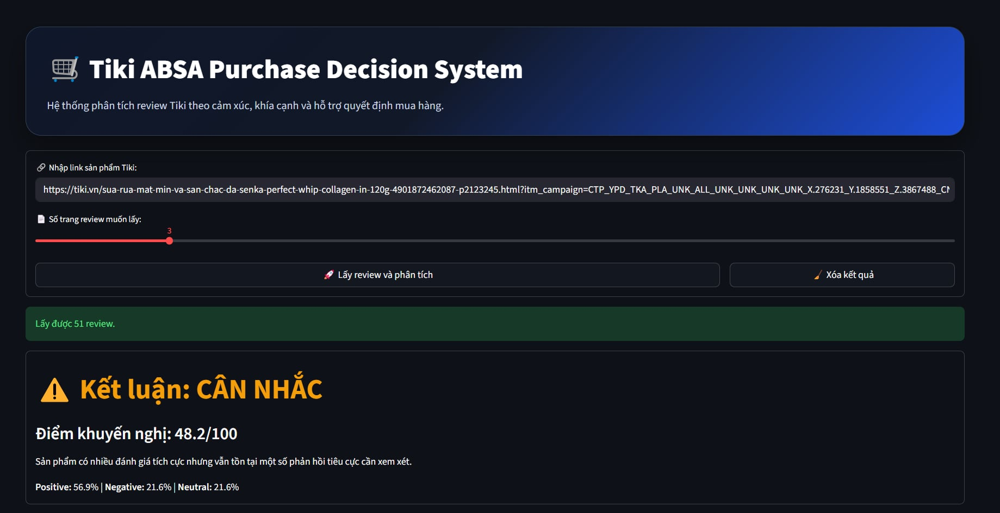
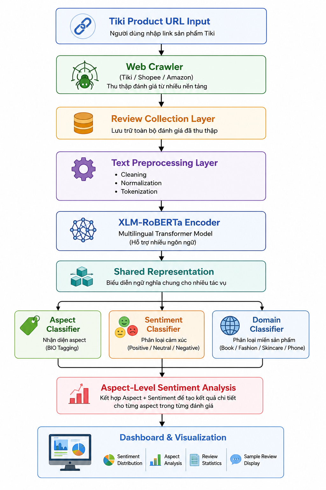

# 🌍 Multilingual & Multi-Domain ABSA for E-commerce Reviews

## Overview
## 📷 Application Demo



## 🏗️ System Architecture




This project develops an Aspect-Based Sentiment Analysis (ABSA) system for e-commerce reviews using XLM-RoBERTa and Multi-Task Learning.

The system supports:

* Vietnamese and English reviews
* Multiple product domains
* Aspect extraction using BIO tagging
* Aspect sentiment classification
* Domain classification
* Language classification

The objective is to automatically analyze customer reviews collected from various e-commerce platforms and identify sentiments toward specific product aspects.

---

## Dataset

### Vietnamese Sources

* Tiki skincare reviews
* Tiki book reviews
* Tiki fashion reviews

### English Sources

* Amazon Kindle Reviews
* Sephora Reviews

### Supported Domains

| Domain   | Description                    |
| -------- | ------------------------------ |
| Book     | Books and e-books              |
| Fashion  | Clothing and accessories       |
| Skincare | Cosmetic and skincare products |


---

## Data Processing Pipeline

### Step 1: Data Collection

Reviews are crawled from multiple e-commerce platforms.

### Step 2: Data Cleaning

* Remove duplicate reviews
* Remove missing values
* Remove extremely short reviews
* Normalize text

### Step 3: Aspect Generation

Aspect labels are automatically generated using domain-specific keyword dictionaries.

Example:

Review:

```text
Áo đẹp nhưng hơi chật
```

Generated aspects:

```text
design
size
```

---

## Model Architecture

### 1. Aspect Term Extraction (ATE)

Model:

```text
XLM-RoBERTa Token Classification
```

Tagging Scheme:

```text
B-ASPECT
I-ASPECT
O
```

Example:

```text
Áo đẹp nhưng hơi chật
```

Output:

```text
Áo      O
đẹp     B-design
nhưng   O
hơi     O
chật    B-size
```

---

### 2. Multi-Task Learning Model

Backbone:

```text
xlm-roberta-base
```

The model simultaneously predicts:

* Aspect
* Sentiment
* Domain
* Language

Architecture:

```text
Review Text
      │
      ▼
XLM-RoBERTa Encoder
      │
 ┌────┼────┬────┐
 ▼    ▼    ▼    ▼
Aspect Sentiment Domain Language
Head   Head    Head   Head
```

---

## Technologies

### Deep Learning

* PyTorch
* Transformers
* Hugging Face

### NLP

* XLM-RoBERTa
* BIO Tagging
* Multi-Task Learning

### Data Processing

* Pandas
* NumPy
* Scikit-learn

### Visualization

* Matplotlib

---

## Project Structure

```text
ABSA-Ecommerce-Project
│
├── backend/
├── frontend/
├── src/
│   ├── crawler/
│   └── models/
│
├── notebooks/
│
├── requirements.txt
├── README.md
└── main.py
```

---

## Installation

Clone repository:

```bash
git clone https://github.com/bear130204/ABSA-Ecommerce-Project.git
cd ABSA-Ecommerce-Project
```

Install dependencies:

```bash
pip install -r requirements.txt
```

---

## Run Application

Frontend:

```bash
streamlit run frontend/app.py
```

Backend:

```bash
python backend/app/main.py
```

---

## Example

Input:

```text
The phone has excellent performance but poor battery life.
```

Output:

```text
performance -> Positive
battery -> Negative
```

---

## Model Files

Due to GitHub file size limitations, trained models are not included in this repository.

Model files:

* multitask_model.pt
* model.safetensors
* tokenizer

can be downloaded separately.

---

## Author

Hoang Linh

Data Science & Artificial Intelligence

University Project: Multilingual and Multi-Domain Aspect-Based Sentiment Analysis for E-commerce Reviews
